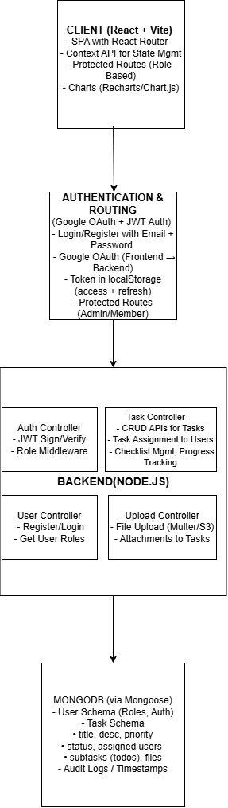

# 🗂️ Task Manager App

---

## 🔗 Live Links

- **Frontend**: https://task-manager-frontend-gdzr.onrender.com
- **Backend**: https://task-manager-backend-tg77.onrender.com
---

## 🧰 Tech Stack

- React.js + Vite  
- Node.js + Express  
- MongoDB + Mongoose  
- JWT + Google OAuth  
- Chart.js / Recharts

---

## 🧱 Architecture Diagram

---

## 🎥 Demo Video

📺 [Click here to watch the demo][(https://drive.google.com/file/d/your-google-drive-id/view?usp=sharing](https://drive.google.com/file/d/1gP-4mYT3hzuBFMsX56p2UMRBkKS6lQLr/view?usp=sharing))

---
## Assumptions
A member can only access tasks assigned to them.

Admin users are invited via a tokenized link(458894) and cannot self-register.

File uploads are stored on the backend’s local directory for simplicity.

The APK was generated using a React Native wrapper around the web app or WebView solution for demonstration.

---

> This project is a part of a hackathon run by [https://www.katomaran.com](https://www.katomaran.com)
